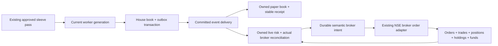

# Execution and security implementation — 2026-10-06

**TRADING BEHAVIOUR CHANGED. Implemented locally for push; no OCI deployment, portfolio reset, broker configuration change or real order. Commercial/live release remains NO-GO.**

This is the next safety milestone from the A–Z programme. It does **not** complete that programme. Production sleeve selection, regime/conviction thresholds, fee constants and the ₹10,000 default remain unchanged. No positive-expectancy stock model or profitable engine has been established by this work.

## Changes and audit scope

| Finding | Implemented | Remaining limitation |
|---|---|---|
| F11 — commit/delivery crash window | House entry/close and its delivery event commit together. A close deletes its exact position in the same transaction, and source-position uniqueness prevents duplicate realised P&L. The production loop drains a durable outbox after commit. Failed deliveries retain their event, lease, attempt count and incident. | Delivery is asynchronous and can miss the approved price allowance. This is not a complete settlement/double-entry accounting system. |
| F19 — duplicate intent | House source events, personal paper entries and broker submissions retain semantic identities. Paper retries return the original fill even after closing. Rebinding the identity to different fields is refused. Lease takeover cannot mark another worker's delivery completed. Broker timeouts retain their unknown reservation. | Historical orders lack new semantic keys; they are not retroactively attributed or replayed. A broker refusal does not authorise a fresh automatic retry. |
| F43 — concurrent paper workers | SQLite worker lease and generation checks refuse old engine writers. House closes, peak/snapshot writes, account entries/exits, order reservation and outbox completion check the active fencing token. | This coordinates one shared SQLite deployment. It is not a distributed queue or fencing of all feed/maintenance workers. |
| F09 — broker evidence | Each entry checks actual positions, holdings, today's tradebook and available margin. External holdings/activity, missing trade evidence, malformed inventory and stale checks block new entries. Broker facts are never adopted as app-owned trades. Account-specific evidence and incidents are persisted. | Normalisation is conservative and requires complete delivery carry fields. Real-account and overnight settlement certification remains open. Fees/P&L remain estimated; exact contract-note reconciliation is missing. |
| F10/F21 — contract identity / ports | Dated instrument snapshots distinguish venue, segment, series, underlying, expiry, strike and right. Lot, tick, freeze and settlement checks are explicit; an index level cannot be ordered. Upstox account operations have a typed read/cancel port and explicit capability matrix. Existing symbol lookup refuses duplicate aliases and checks a catalogue when present. | Discovery covers more assets than executable routes. No derivative/US/BSE adapter, margin/rollover/physical settlement or multi-leg compensation has been completed. Raw provider metadata cannot certify execution; unknown units/series remain unknown. Legacy universes without a catalogue retain the existing unambiguous NSE-key path and are not master-certified. |
| F18 — idea/manual contract | An owned, immutable publication read API exposes original levels/quantity/version. The generic Buy API refuses research-publication requests. Manual quantity is now honoured exactly or refused by account risk; it cannot silently substitute a larger/smaller quantity. Original paper receipts survive retries. | Research stock publications remain unapproved. There is no approved executable stock-idea model to promote. UI review still states that execution is unavailable. |
| F36 — secrets at rest | Account-bound authenticated Fernet envelopes replace plaintext broker-state JSON. State files and the local vault key are private; complete keys are published atomically without replacing another worker's key. Existing owner files migrate on read. Tampered/swapped files refuse access and show a redacted credential error. | The locally held key needs separate escrow; this is not KMS/HSM protection against a compromised application host. Deploy-time backup/restore and key-rotation certification are still required. Legacy archive files are encrypted too. |
| F38 — session revocation | Production login issues a persisted hashed session identity. Logout revokes it server-side; copied cookies stop working while another session can remain valid. | Previous cookies require reauthentication after rollout. All-session revocation, persisted multi-worker login throttling and trusted-proxy/CSRF review remain open. |
| F44/F46 — verification | CI keeps paper execution disabled, uses isolated broker storage, runs unittest plus the previously omitted pytest function fixtures, and executes a deterministic restart/replay/ownership paper rehearsal. Account UI displays reconciliation and credential failures with escaped text. | This is not a deployed full-page browser, WCAG, load, penetration or 30-session market certification. Skipped legacy tests are not release evidence. |

## Runtime wiring



`v2_live.record_entry()` no longer performs mirror I/O while writing the house book. `record_exit()` atomically captures the close and deletes the source position. `v2_live.loop()` drains committed events during the session. Late entries require a fresh quote inside the existing slippage allowance and a still-open source in the same house epoch; pre-reset entries are not restored to a newer personal epoch. Personal exits match the exact origin, independent of subscription. Failed personal/live exit deliveries remain retryable; disconnected owners with broker obligations are retained.

Delivery does not claim an identical price across accounts or actual exchange fills. It is deliberately possible to record an owned missed-entry incident. The current `MIRRORED_LANES` still excludes the only approved production sleeve, `index_directional`; automatic production live trading is therefore still unimplemented. This change does not override that strategy-promotion decision.

## Operational commands

From the repository root, using an isolated/staging database first:

```sh
.venv/bin/pip install -r requirements-dev.txt
OPENSTOCKS_DISABLE_V2=1 .venv/bin/python -m unittest discover -s tests -t . -v
OPENSTOCKS_DISABLE_V2=1 .venv/bin/python scripts/run_function_tests.py
OPENSTOCKS_DISABLE_V2=1 .venv/bin/python scripts/rehearse_execution.py
```

Download/import the official instrument master daily before a session. The declared source date is recorded but does not independently prove provider freshness. Unknown records are quarantined rather than assigned guessed contract units. Preserve the source and review artifact under ignored `var/`:

```sh
.venv/bin/python scripts/sync_instrument_catalog.py --download \
  --db var/instrument-staging.db --source-day YYYY-MM-DD
```

An archived JSON/JSON.gz file can replace `--download` using `--input PATH`. Do not switch production to an incomplete master or interpret a successful import as permission to trade its contracts. The API reads the catalogue in the configured main database; the staging file must be reviewed and explicitly imported into that database before it can be used there.

Read-only authenticated endpoints:

- `/v2/api/execution-health`: this account's reconciliation, unresolved incidents and explicit implementation/certification capabilities.
- `/v2/api/instrument?symbol=SYMBOL&venue=NSE&segment=NSE_EQ`: dated canonical contract; missing/stale/ambiguous catalogue returns 409.
- `/v2/api/idea-publications/ID`: owned original plan; other-account IDs return 404; execution approval remains false.

Before rollout: back up both databases and broker state, escrow the vault key separately, install dependencies, initialise/verify the additive `execution-safety-v2` schema, test restoration in staging, and require reauthentication. Existing production portfolios and credentials have not been inspected or modified by this implementation pass. Do not delete the vault key or replace an unreadable encrypted account file with defaults.

## Validation

Focused execution/account checks: 104 passed. Research/UI function fixtures: 101 passed, including owned immutable publications and executed DOM fixtures. The isolated ₹10,000 paper rehearsal reported zero duplicate delivery, zero ownership errors, no negative cash and zero broker orders. Its synthetic trade made ₹124.55 after the existing fee model; **that is a test fixture, not profitability evidence**.

Final full suite: **2,254 run; 2,121 passed; 133 skipped; zero failures/errors**, process exit 0. Separate research/UI run: **101 passed**, exit 0. The staged public-repository secret scan: **4 passed**. The fixture rehearsal exited 0. Skipped tests are not counted as passed. Earlier failures were retained and repaired: an incorrect deferred entry call, missing reconciliation evidence in old order fixtures, missing new route mappings, and a Telegram fixture path that depended on suite import order. No risk/reconciliation gate was disabled to obtain a pass.

## Required next work

1. Verified point-in-time liquid stock membership, adjusted prices, quality fundamentals, corporate actions and decision-time news; untouched after-cost portfolio validation and an independent forward cohort. Keep losing/untouched versions in the evidence. No rule promotion from a short winning sample.
2. Native protective broker orders with verified partial-fill resizing, stop/target cancellation, protection failure compensation, token-outage recovery and broker-contract tests. Local stop management is not crash-independent protection.
3. Contract-certified paper/execution adapters for BSE/US, futures/options/currency/commodities, settlement/ban/circuit calendars, SPAN/exposure margins, freeze slicing and defined-risk multi-leg compensation. Each route requires independent acceptance and market rehearsal.
4. Database-wide immutable ownership/accounting postings, corporate-action/settlement handling, real daily baselines and contract-note cost reconciliation; encrypted backup/restore and disaster recovery drills.
5. Full product flows, responsive/browser/WCAG verification, onboarding/risk profiles, billing payment reconciliation, alerts/SLOs and operational release gates.
6. Regulatory/legal review, data rights and retention/privacy decisions; SEBI/broker certification and documented permission before live enablement. White-box scoring is not assumed to waive research-adviser obligations.

These are open deliverables, not code changes claimed complete by this push. The measurable live release bar remains zero known Blocker/Critical defects, zero unexplained account divergence, certified protection and a documented 30-session paper observation period.

Primary contracts used: [Upstox instruments](https://upstox.com/developer/api-documentation/instruments/), [Upstox API definitions](https://api.upstox.com/v2/swagger-ui/index.html), [cryptography](https://pypi.org/project/cryptography/50.0.2/), [pytest](https://pypi.org/project/pytest/9.0.3/). Only existing NSE order routing is implemented; discovery and documentation do not establish broker certification.
