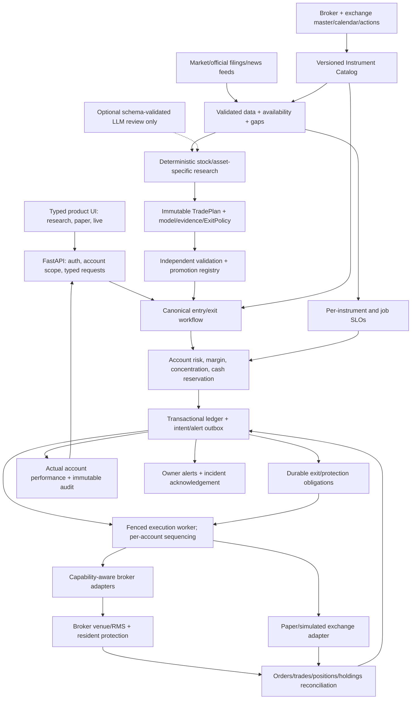
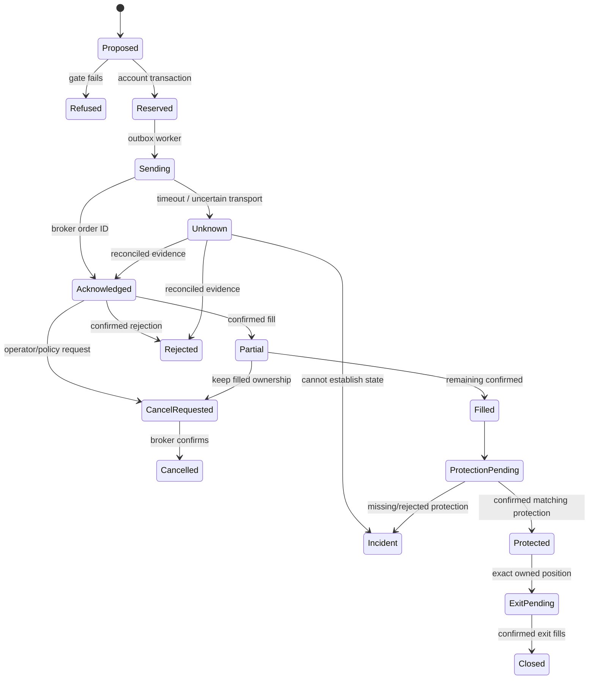
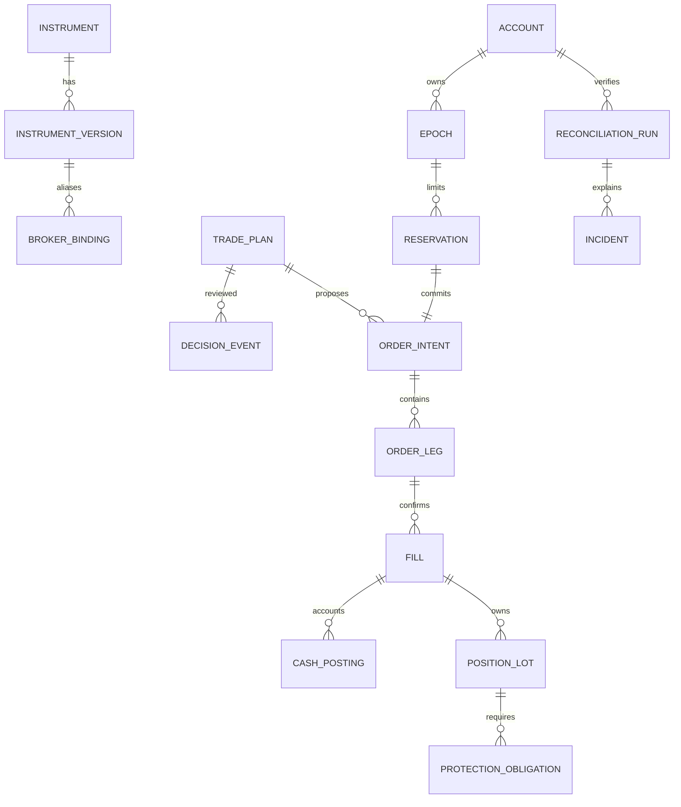
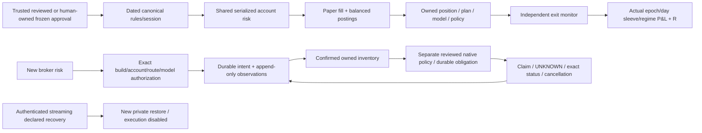
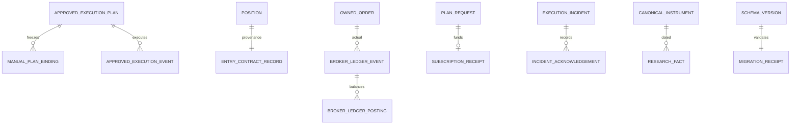

# C. Target architecture and data model

Use a **modular domain core** with separately supervised data and execution workers. Do not add a service for every strategy. Introduce durable SQL transactions/outbox and a single fenced execution owner before scaling; move the trading ledger to PostgreSQL when multi-process account throughput warrants it. The existing SQLite ledger must be migrated with reconciled snapshots, not discarded. React/TypeScript is a proposed frontend target, not the current stack.



The LLM cannot create an order or override data, strategy, account, margin or compliance refusal. Broker credentials never enter prompts. Broker/websocket events are untrusted and require account, instrument and intent matching.

## Unified Instrument abstraction

```python
@dataclass(frozen=True)
class Instrument:
    id: UUID
    venue: str                 # NSE, BSE, MCX, US venue; not just IN/US
    segment: str               # equity, equity_derivatives, currency, commodity...
    venue_key: str             # exchange-authoritative identity
    symbol: str                # display alias, not identity
    kind: InstrumentKind       # EQUITY, ETF, INDEX, FUTURE, OPTION, CURRENCY, COMMODITY
    series: str                # EQ/BE/SME/etc. explicit; not all allow intraday
    underlying_id: UUID | None
    expiry_at: datetime | None
    strike: Decimal | None
    option_right: str | None    # CE/PE only when applicable
    base_currency: str
    quote_currency: str
    tradable: bool
    version_id: UUID
```

An index is reference data; it is not directly orderable. Discover **all broker/exchange listings**, including restricted series, but execute only combinations allowed by venue, broker, customer permissions, strategy validation and capital. “All instruments” means a complete catalogue and extensible execution contract, not a promise that every asset/series/broker combination can be traded from ₹10,000.

## Proposed relational entities

| Entity | Required fields and relationships | Key invariants |
|---|---|---|
| Security | security_id, ISIN when available, issuer, legal name, asset class | An ISIN may have several venue listings; derivatives/indices need not have an ISIN |
| Instrument | instrument_id, venue, segment, venue_key, series, symbol aliases, kind, security/underlying FK | Unique venue/segment/venue_key; no ticker-only uniqueness |
| InstrumentVersion | version_id, instrument FK, effective_from/to, captured_at, source/hash, expiry/strike/right, lot/min_qty/qty_step, multiplier, tick_size, freeze_qty, price bands, currency, status, settlement_type/delivery cutoff | Immutable snapshots; units/precision/validity explicit; future data cannot apply to earlier decisions |
| BrokerInstrumentBinding | broker, instrument FK/version, broker token/key, product/order/validity capabilities, effective interval | Stable token mapping by broker/segment; stale/ambiguous binding blocks submission |
| VenueSession | venue/segment, timezone, session_date, phase intervals, holidays/half days/exceptional sessions, source/version | Expiry is evaluated in the correct session, not a guessed weekday |
| CorporateAction | security/instrument FK, action type, announcement/availability/ex/effective dates, ratio/cash value, official source | Adjust research consistently; reconcile inventory via postings; do not rewrite confirmed trades |
| RestrictionSnapshot | instrument, venue/broker/account scope, ban/suspension/T2T/circuit/trade permissions, availability/validity | New/increasing-risk orders respect applicable F&O bans and series restrictions; exits remain separately assessed |
| Account | account_id, user FK, mode, broker identity, currencies, approved capability/permission profile, epoch | Every mutation requires ownership; paper and broker holdings stay distinct |
| RiskEpoch | epoch_id, account FK, approved capital, started_at, persistent peak, session baseline, entry/protection state | Explicit capital changes only; chart pruning cannot erase peak or risk history |
| TradePlan | plan_id/version, model/version, instrument/version, account eligibility, direction, entry zone, quantity denomination, targets, expiry, policy FK, evidence IDs | Immutable publication; each replacement version retained; Research is not Eligible or Filled |
| ExitPolicy | version, stop/trailing/time/regime/expiry rules, policy provenance | Persist with position; replay and live evaluate the same contract |
| DecisionEvent | account, epoch, plan/version, availability time, regime, score components, refusals, risk/margin snapshot, approved qty | One immutable explanation per accepted/rejected decision; no unlogged LLM override |
| MarginSnapshot | account, instruments/legs, broker/RMS reference, timestamp, initial/exposure/delivery margin, buffers | Fresh and account-specific; contingent hedge fill does not count as an actual filled hedge |
| RiskReservation | account/epoch, intent FK, cash/fees/risk/margin, quantity, state, version | Atomic against all outstanding account commitments; no negative available balance |
| OrderIntent | id, account/epoch, plan/action, instrument/version, broker, side/product/type/validity, qty/price/trigger, stable idempotency key, state/version | Durable before network; unique semantic intent; no blind retry after UNKNOWN |
| OrderLeg | parent strategy intent, leg sequence, instrument, side, qty, role, dependency/compensation policy | Multi-leg batch is not atomic; no short exposure before confirmed protective leg under defined-risk policy |
| BrokerOrder | intent/leg FK, broker/exchange ID, status revision, requested/filled/pending qty, timestamps, rejection evidence | Monotonic fill quantity; cancellation request is not confirmation; terminal messages cannot erase fills |
| Fill | broker/account fill identity, order/leg FK, instrument, qty, actual price, currencies, fee/settlement refs | Unique applied fill; confirmed evidence only; no “submitted equals filled” |
| PositionLot | account/epoch, instrument, originating plan/intent/house-position IDs, filled/remaining qty, cost basis, product, policy | Exit exact managed ownership; unrelated manual holdings are never symbol-closed |
| CashPosting | account/currency, fill/fee/margin/settlement FK, debit/credit, amount, value date | Fixed precision, balanced/reconcilable ledger; settled vs available vs reserved explicit |
| ProtectionObligation | position FK, desired qty/stop/target/policy, broker protection IDs, state/reconciliation times | Survives process, house removal and entry disarm; “protected” requires broker evidence |
| ReconciliationRun | account, source watermark, inventory/funds/order differences, unresolved incident IDs | No entry through an unresolved critical mismatch |
| AuditEvent | event ID/sequence, account, actor/type/model/build/config, UTC time + venue context, correlation/causation IDs, payload hash, previous hash, redacted payload | Append-only application API; external checkpoints/access controls needed for tamper evidence |
| AlertOutbox | account/incident, severity, exposure, action required, delivery attempts, acknowledgement/escalation | Notifications are durable and deduplicated; secrets redacted |
| ModelApproval | version, asset/timeframe/capital scope, frozen protocol, untouched results, operational certification, approver | Paper/real capability approvals are explicit and revocable without losing exit obligations |
| Session / CredentialRef | revocable session/auth version; encrypted broker secret reference/key version | No token in public payload/log/LLM; per-account access, rotation and audit |

Schema is a target design, not a migration script. Use FK/UNIQUE/CHECK constraints and transaction versions, and store fixed-precision monetary values rather than binary floating point.

## Execution state machine



Implementation needs independent order status, fill quantity, position and protection state rather than one overloaded status column. UNKNOWN retains reservations/ownership until reconciled; never resolve it solely by a TTL.

## Broker port and staged asset support

Common adapter methods: instrument sync, market status/calendar references, quote/depth read, funds/margin estimation, submit/modify/cancel with stable tags, order/trade lookup, positions/holdings, protection and update stream. Every adapter publishes a **tested capability matrix** for venue/segment/product/order/validity/protection/sandbox.

- Paper is the first adapter, sharing decisions/risk/intents/exit policies with live while using a later-event simulated fill and venue constraints.
- Reconcile the existing active Upstox journal into the port first; do not bypass its useful reservations.
- Angel One SmartAPI is a new adapter, not an existing integration. Its current [official documentation](https://smartapi.angelone.in/docs) and instrument schema must be validated against installed API versions and account permissions.
- Certify Zerodha/Dhan/others separately. Existing market-data provider classes are not proof that their order adapters work.
- Equity/ETF first; actual affordable index products next; futures and conservative defined-risk options after certified margin/expiry/legging protection. Support short-volatility structures only if their complete risk policy is approved; naked strangles are not enabled by a generic multi-leg facility.
- Currency/commodity/US support requires its own broker, account eligibility, contracts/calendar/cost/settlement/data rights. Reject or label unavailable capabilities rather than inventing a synthetic fill.


## Current implementation boundary — audit refresh

The diagrams above are target architecture. Actual local additions: sourced all-writer canonical gate; immutable approved/manual NSE cash-paper pipeline; actual owned Upstox fill ledger with independently sourced assessment/settlement events; reviewed native terminal-fill policy and partial-remainder cancellation; Angel One transport only; atomic receipt/access and startup migrations; immutable decision-time facts; authenticated streaming disabled restore. All reported live routes remain uncertified. House/live approved-plan convergence, complete net/margin/FX accounting, production official raw connectors, broker-native certification and Angel orchestration remain open.



Canonical quantities, money, currencies, settlement and effective rules remain explicit. A multi-leg parent does not make exchange execution atomic; compensation never assumes an unfilled hedge. Migration must quarantine unknown owner/contract/plan relationships, preserve old records and refuse new risk until the specific route is certified.

## Implemented additive cash-paper path (not the full target)



Previously added actual entities: `approved_execution_plans/events`, `execution_contract_evidence`, `live_execution_events`, `protection_obligations/events`; existing personal positions/trades gain canonical instrument/plan/model provenance. These are tested narrow additions. Full Security/InstrumentVersion migration, all-adapter reservation/fill/fee/settlement convergence, automatic certified native coverage and extra brokers/assets remain target architecture, not implemented boxes in this diagram.

## Current local entities added in this continuation



`manual_plan_bindings`, broker ledger events/postings, subscription receipts, incident acknowledgements, PIT facts and migration receipts are immutable where they express history. Final net/margin and additional-asset execution remain unavailable rather than invented. The paper approval path and live durable journal share contract/risk gates, but are not yet one complete all-adapter plan/settlement orchestration.
